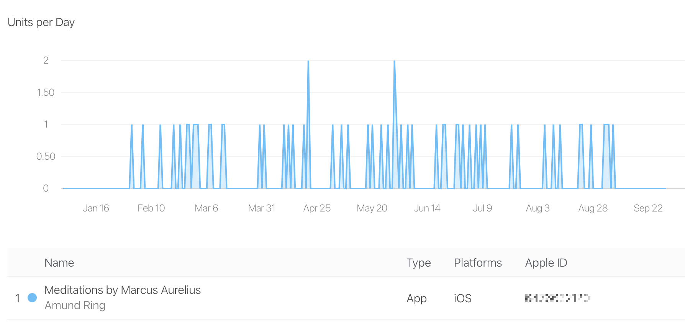

 
**Note**: This is a blank repository intended to showcase the README and screenshots for the app ***Meditations by Marcus Aurelius***.
The actual source code is maintained in a private repository to safeguard the application's security and because it is not released
as open-source.
 
 

# 📖 Meditations by Marcus Aurelius

The Meditations app provides users with the teachings of Marcus Aurelius, Roman Emperor and Stoic philosopher, in a simple and elegant interface. Designed to be intuitive and engaging, this app helps users access timeless wisdom and reflect on their daily lives.

[Available in the App Store](https://apple.co/3Mygopg)  

## 🌟 Features

- **Elegant Carousel Interface**: Each section in the 12 books of Meditations is presented in a simple, swipeable carousel for easy reading.
- **Customizable Reading Experience**: Choose from six font styles and adjust the font size to suit your preferences.
- **Favorite Sections**: Mark your favorite passages with a heart and easily access them from the favorites page.
- **User-Friendly Navigation**: Seamlessly swipe between sections, or jump to any chapter using the intuitive contents list. Favorites are highlighted with a golden color to make them stand out.

---

---

## 🛠️ Technologies Used

- **React Native**: JavaScript framework for building native mobile apps using JavaScript and React components.
- **React Navigation**: Smooth and flexible screen transitions.
- **AsyncStorage**: Local data storage to save lesson progress and user settings.
- **Expo**: Used to manage the development process and streamline cross-platform builds.
- **React Native Snap Carousel**: Allows for the implementation of the sleek, swipeable carousel interface.

---

## 📊 App Sales

The *Meditations by Marcus Aurelius* app has maintained a fairly steady sales performance, averaging about 5-10 units per month. This consistent sales activity demonstrates the app’s ongoing appeal to users seeking Stoic wisdom in a modern, accessible format.

